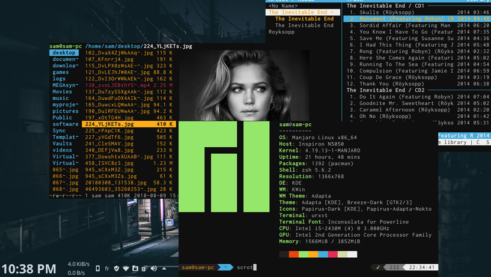

# dotfiles
#### Contains configuration files about : 
- urxvt 
- ranger 
- zsh
- qutebrowser
- bash 

## Sync the files with git
To run it automaticaly run these commands:
```
$ dotfiles (which is just an alias for a longer script)
```
```
$ git add --all
```
```
$ git commit -m "write down a commit message"
```
```
$ git push
```

## Some useful commands
```
$ convert scrot.png -resize 60% scrot.png
```

## Screenshots

