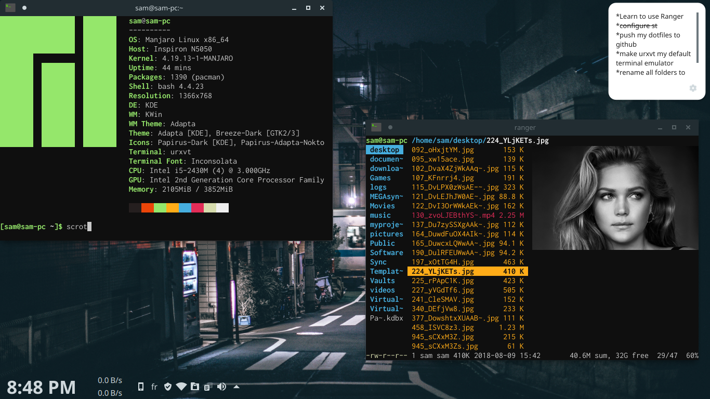

# dotfiles
#### Contains configuration files about : 
- urxvt 
- ranger 
- zsh
- qutebrowser
- bash 

## Screenshots

To run it automaticaly run these commands:
$dotfiles (which is just an alias for a longer script)
$git add --all
$git commit -m "write down a commit message"
$git push
